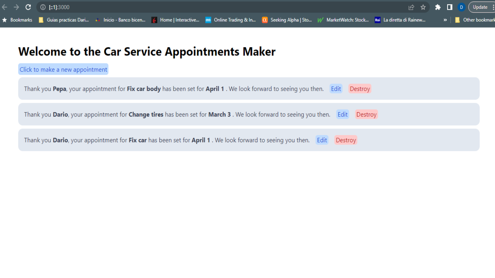
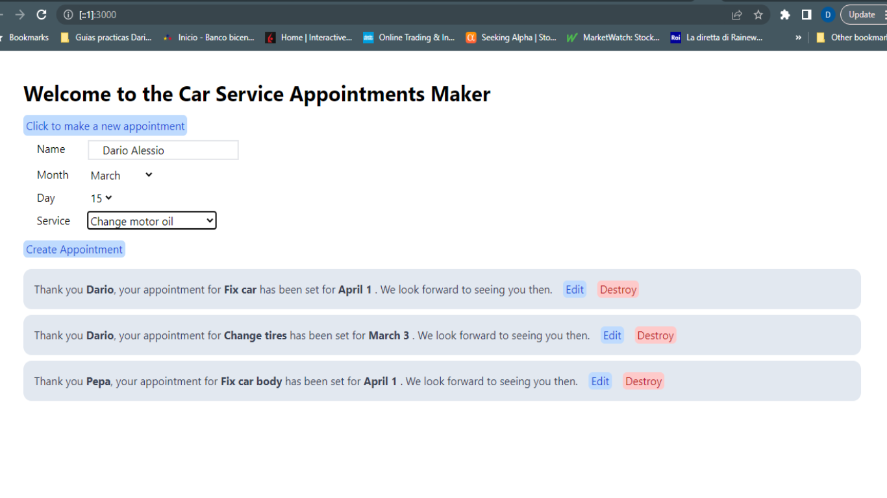
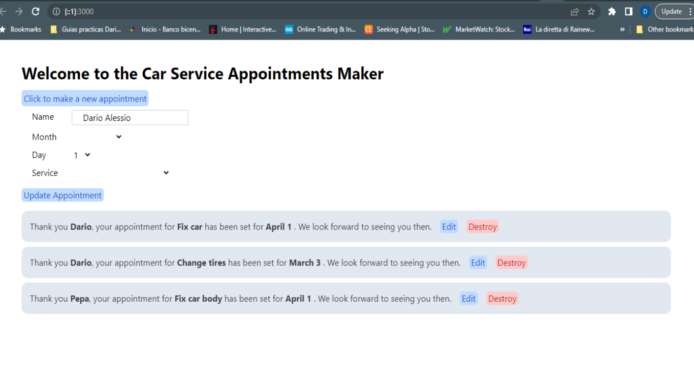
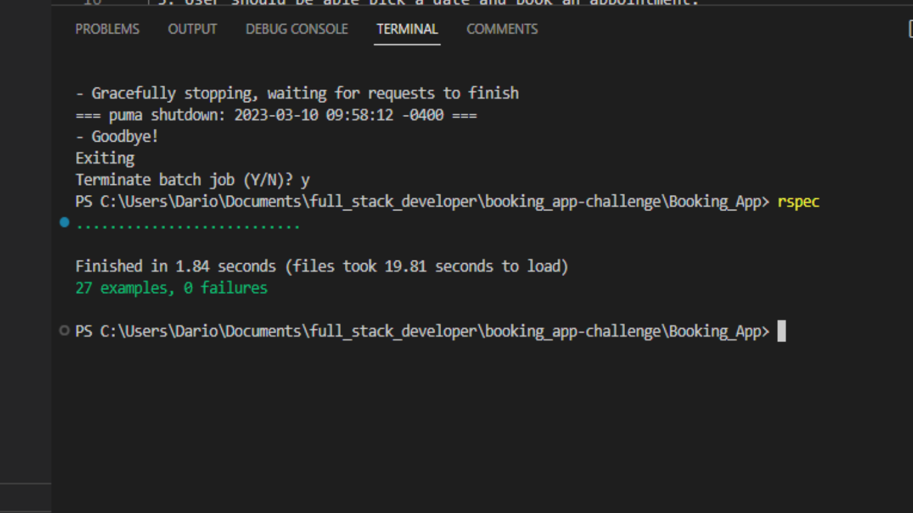

# Booking App

This is Ruby on Rails SPA that lets you create appointments. It uses
Hotwire Turbo Frame and Turbo Stream to render all views in the root directory only.

The style has been made only with Tailwind.

This is a view if the index:



This is a view of the New in the index:



This is a view of the Edit in the index:


All the app functioning happens in the root (Localhost:3000 in the case of local)

## Project Requirements

Build a simple appointment application using Hotwire from rails.

 1: The app should be on one page. 
 
 2: Use tailwind css or bulma for styling. 
 
 3: User should be able pick a date and book an appointment. 
 
 The appointment should appear on the page immediately without a full page refresh. 

## Built With

- Ruby
- Ruby on Rails
- HTML
- Tailwind
- PostgreSQL
- Git & Github

## Setup

1. You would need to have a computer with Ruby, Ruby on Rails and Postgresql installed to run it.
2. Follow these steps on your console to properly clone this repository on your desktop:

```
$ git clone https://github.com/DarioAlessioR/Booking_App.git

$ cd Booking_App

$ code .

$ In the root directory run: gem install bundler

$ Then run: bundle install

$ Run ruby app in the Command Line: rails s

$ To run test cases in the Command Line type: rspec
```
This is a view of the terminal after running rspec:


## Live Demo

The app is deployed on Render free service. Please, allow a few seconds for it to load, as the Render's free service is slow by default.

Visit the live demo at:  https://booking-app2-18g6.onrender.com


## Author

👤 **Dario Alessio**

- GitHub: https://github.com/DarioAlessioR
- Slack: https://microverse-students.slack.com/team/U039GCFRK9B
- LinkedIn: https://www.linkedin.com/in/dario-alessio/?locale=en_US

## 🤝 Contributing

Contributions, issues, and feature requests are welcome!

Feel free to check the [issues page](../../issues/).

## Show your support

Give a ⭐️ if you like this project!

## Acknowledgments

- Hat tip to anyone whose code was used
- My supportive family 😊

## 📝 License

This project is [MIT](./LICENSE.md) licensed.